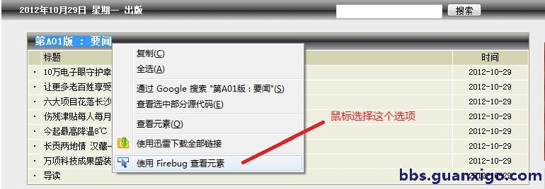
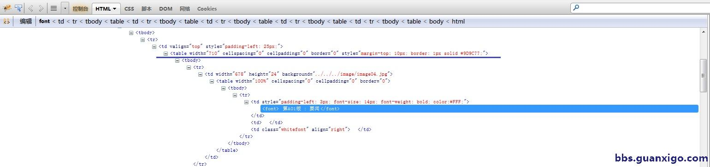
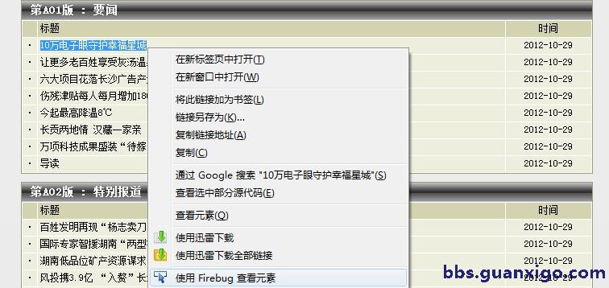
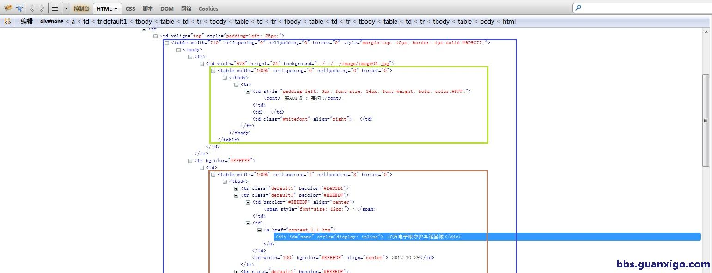

在上一篇教程中，我们简单介绍了httpfox的使用方法，这里我补充一下，httpfox是firefox浏览器的一个插件， 前提是你必须安装firefox浏览器。这里我强烈建议希望继续这篇教程的同学马上安装firefox浏览器（或者Chrome），它简直是web开发必不可少的神兵利器。 除了可以辅助web开发，我觉得它也可以作为平时浏览网站所主要使用的浏览器。它比IE加载速度要快得多，javascript的执行效率也高很多，最大的缺点是不支持国内网银所使用的activex控件。 严格来说这不是firefox的缺点，是国内网银开发商的局限。淘宝对firefox的支持就做的很不错，这里表扬一个! Firefox又叫火狐浏览器，可以到这里下载: [http://firefox.com.cn/](http://firefox.com.cn/)

在第二篇中我们介绍了要构造某新闻网站的新闻索引页的URL地址， 在Firefox中你将鼠标移到该网站的“页面概览”链接上，浏览器左下角就会显示该新闻索引页的URL地址。 这就是为什么我们知道构造的新闻索引页的结构是这样的原因。

我们假设已经获取到了新闻索引页的HTML页面，那么我们下一步就是要正确解析这个HTML页面来抓取我们感兴趣的内容。这里我们又将接触到另外一个强大的Firefox中的web开发插件: firebug, 这个工具很强，我们现在所使用的只是他的一些基本功能，我们希望利用这个工具来展示要抓取的内容在整个HTML页面中的位置和与其他HTML元素的关系。

第一步： 我们关心并想获取新闻所处的新闻版块的信息。以A01版为例，我们在Firefox中用鼠标选择”A01版 要闻“, 然后鼠标右键点击选中的内容，并选择“使用Firefox查看元素"



图片一： Firefox显示网页元素信息

第二步： 在Firefox浏览器下方会出现firebug的窗口，其中我们选中的内容会同样以HTML源代码的方式显示在下面的窗口中



图片二： Firefox定位网页元素源代码

我们可以看到新闻版块- "第A01版：要闻” 那一行是以蓝色的背景色显示，这与我们在浏览器中选择的部分一致。这部分内容就是我们抓取后要解析出的内容，我们可以简单看到它在HTML结构中处于什么层次。 
它是包含在这样的元素层次中：

	<table width="710"...>
	  <tbody>
	    <tr>
	      <td width="678" ....>
	        <table width = "100%" ...>
	          <tbody>
	            <tr>
	              <td>
	                <font> 


第三步： 在新闻索引页中，我们点击一个新闻标题，我们就会打开一个具体的新闻页面， 那么我们同样关心在某新闻版块中的某个新闻的名称以及它的具体新闻页面的URL. 我们在Firefox中选中某个新闻标题，然后鼠标右键点击该选中部分，在弹出的菜单中选择“使用Firefox查看该元素”



图片三： Firefox在新闻列表中查看某条新闻标题

第四步： 我们会在下方的firebug窗口中看见所关心的内容的html元素信息，这里我们可以看见有3个HTML表格将我们前几步所需要的信息全部囊括起来。外部蓝色的表格```<table width="710" ...>```包含了绿色的版块内容表格和棕色的新闻标题表格。

	<ul>
	<li>新闻的URL位置在：
	
	<pre><code><table width="710"...> ->
	  <tbody>
	    ...
	    < 第二个tr>
	      <table width = "100%" ...>
	        <tbody>
	          ...
	          < 某个tr>
	            ...
	            < 第二个td>
	              <a> 

新闻标题的位置在：

	<table width="710"...>
	  <tbody>
	    ...
	    < 第二个tr>
	      <table width = "100%" ...>
	        <tbody>
	          ...
	          < 某个tr>
	            ...
	            < 第二个td>
	              <a>
	                <div> 



图片四： Firefox显示网页元素HTML层次

使用firebug我们轻易的定位的到了我们所关心的内容在HTML页面整个Dom层次中所处的位置以及和其他HTML元素的关系。如果我们能够将所有```<table width="710" ...>```的表格（蓝色表格）获取出来，然后获取其中的第一个```<table width="100%">```绿颜色表格）中的第一行第一列内容，我们就得到了新闻版块的信息， 如果获取其中的第二个```<table width="100%">```棕色表格）中的第二行第二列内容，我们就得到了新闻标题和新闻链接。

那么有什么快捷的方式可以解析HTML页面来抓取我们想要抓取的HTML元素呢？ 有同学说用正则表达式，对，我们基本上所有的问题都可以用正则表达式来处理，不过复杂的正则表达式读起来让人觉得头皮发麻。 有同学说可以用python里自带的的HTMLParser库，这个方案也行，但是当遇到不规范的HTML格式时，这条路就行不通了。 这里我们最好的选择是lxml,这是一个第三方的xml/html解析库，底层是利用的libxml，libxslt,和beautysoap的库，做到了pythonic，性能很高，容错性不错，也支持xpath. 

我们下一篇中将详细介绍怎样用lxml来解析html页面，累了，先休息休息！