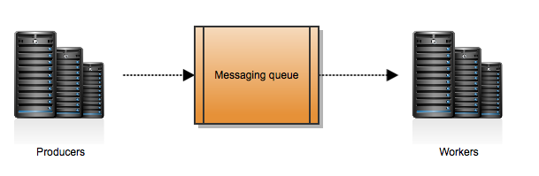

Pygigo is a simple framework focus on distributed web accessing. It based on folllowing technologies:

- AMQP protocal
- Distributed Task queue
- Web framework

Here be more specific, AMQP protocal implementation now uses Redis, Distributed Task Queue uses Celery, web framework uses django. All of those are the best one in their own area. What we want to implement is all the web requests are abstrated/assembled then routed via AMQP protocal to different servers, and business logic are done on different servers. The rapid developmenet, scalable, deployment, and fault tolerable is our purpose.

In the future, above implementation may be changed, but now we choose them because: [Queue everything and delight everyone](http://decafbad.com/blog/2008/07/04/queue-everything-and-delight-everyone/)

Most of people are familiar with Django, so I would like to introduce Redis and Celery in the very beginning.

Chapter One: Message Broker

Here Message Broker is an implementation of AMQP protocal, and what is AMQP, pls refer to this good document: [AMQP in 10 mins](http://rajith.2rlabs.com/2007/10/13/amqp-in-10-mins-part3-flexible-routing-model/)

#### Celery Introduction

Celery is an asynchronous task queue/job queue based on distributed message passing.
- Celery Application/Client/Producer: add task to queue
- Celery Worker/Server/Consumer: execute task
- Message Broker: implement message receive/route/send

For simple application, we deploy Celery Application/Celery Worker/Message Broker on one server. But if our busniess logic need more system resource to handle, e,g: modal rendering for CPU consumping job, we can scalae it by adding more servers. For example, run Celery worker on server B, but run Celery application and message broker on server A.

The basic job handling workflow in Celery is following:

    Define a Celery task 
        -> Trigger Celery application and put task into job queue
            -> Celery worker receive the job and handle it

The basic Woker：

1. Get Task
2. Worker starts task
3. Ack Sent to Broker
4. Worker Finishes task

Ack Later Worker(acks_later=True)：

1. Get Task
2. Worker starts task
3. Worker Finishes task
4. Ack Sent to Broker

#### Reference
- [Scaling Celery:Sending Tasks To Remote Machines!](http://www.avilpage.com/2014/11/scaling-celery-sending-tasks-to-remote.html)
- [Celery Messaging at Scale at Instagram](http://lc0.github.io/blog/2013/05/01/celery-messaging-at-scale-at-instagram/)